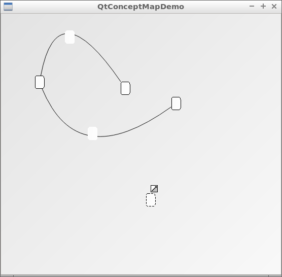

# QtConceptMap

C++14 concept map widget class using Qt

## Controls

See [controls](doc/controls.md).

## [Scripting](doc/scripting.md)

QtConceptMapDemo allows scripting the creation of a QtConceptMap. See [scripting](doc/scripting.md) how to do so.

## Build status of builds that QtConceptMap relies on

