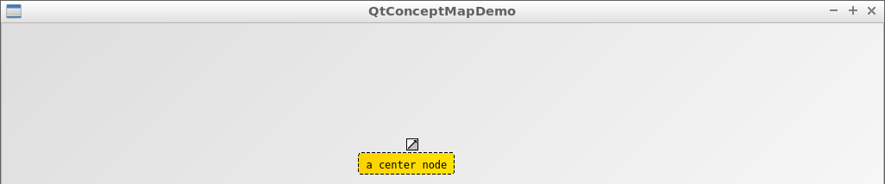

# Scripting

QtConceptMapDemo allows scripting:

 * `create_new_edge`
 * `create_new_node`
 * `move`
 * `set_mode`
 * `toggle_arrow_head`
 * `toggle_arrow_tail`
 * `unselect`


## `create_new_edge`

## `create_new_node`


```
./QtConceptMapDemo --command "set_mode(edit); create_new_node(not a center node, false, 0, 0)"
```



```
./QtConceptMapDemo --command "set_mode(edit); create_new_node(a center node, true, 0, 0)"
```

## `move`


## `set_mode`

`set_mode` allows to set the mode of the QtConceptMap:

  * `set_mode(edit)`: edit mode, modify the text and number of nodes and edges
  * `set_mode(rate)`: rate mode, assign a rating to the nodes and edges
  * `set_mode(uninitialized)`: uninitialized mode, can do neither

### `set_mode(edit)`

```
./QtConceptMapDemo --command "set_mode(edit); create_new_node(hello, false, 0, 0)"
```


### `set_mode(edit)`

```
./QtConceptMapDemo --command "set_mode(rate); create_new_node(hello, false, 0, 0)"
```


### `set_mode(uninitialized)`

```
./QtConceptMapDemo --command "set_mode(uninitialized); create_new_node(hello, false, 0, 0)"
```


## `toggle_arrow_head`

## `toggle_arrow_tail`

## `unselect`


