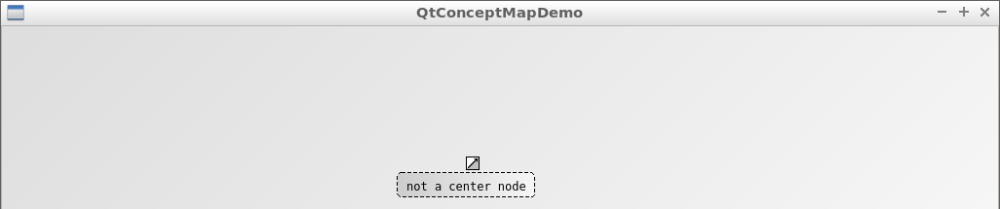

# Scripting

QtConceptMapDemo allows scripting:

 * `create_new_edge`
 * `create_new_node`
 * `move`
 * `set_mode`
 * `toggle_arrow_head`
 * `toggle_arrow_tail`
 * `unselect`

```
--command "set_mode(edit); create_new_node(center, true, 0, 0); unselect(center); create_new_node(from, false, 0, -50); create_new_node(to, false, 0, 50); create_new_edge(relation); move(relation, 200, 0); toggle_arrow_head(); toggle_arrow_tail()" //!OCLINT
```

## `create_new_edge`

## `create_new_node`

Syntax:

```
`create_new_node([text on node],[center node true/false],[x coordinat],[y coordinat])`
```

 * `[text on node]`: text to put on node. May not contain commas
 * `[center node true/false]`: set to `true`if the node is a center node, use `false` otherwise. A QtConceptMap may only have one center node
 * `[x coordinat]`: position towards the right, can be any integer, center has coordinat `(0,0)`
 * `[y coordinat]`: position towards the bottom, can be any integer, center has coordinat `(0,0)`



```
./QtConceptMapDemo --command "set_mode(edit); create_new_node(not a center node, false, 0, 0)"
```


```
./QtConceptMapDemo --command "set_mode(edit); create_new_node(a center node, true, 0, 0)"
```

## `move`


## `set_mode`

`set_mode` allows to set the mode of the QtConceptMap:

  * `set_mode(edit)`: edit mode, modify the text and number of nodes and edges
  * `set_mode(rate)`: rate mode, assign a rating to the nodes and edges
  * `set_mode(uninitialized)`: uninitialized mode, can do neither

### `set_mode(edit)`

```
./QtConceptMapDemo --command "set_mode(edit); create_new_node(hello, false, 0, 0)"
```


### `set_mode(edit)`

```
./QtConceptMapDemo --command "set_mode(rate); create_new_node(hello, false, 0, 0)"
```


### `set_mode(uninitialized)`

```
./QtConceptMapDemo --command "set_mode(uninitialized); create_new_node(hello, false, 0, 0)"
```


## `toggle_arrow_head`

## `toggle_arrow_tail`

## `unselect`

Unselect a node or edge by name

```
./QtConceptMapDemo --command "set_mode(edit); create_new_node(my name, false, 0, 0); unselect(my name);
```
